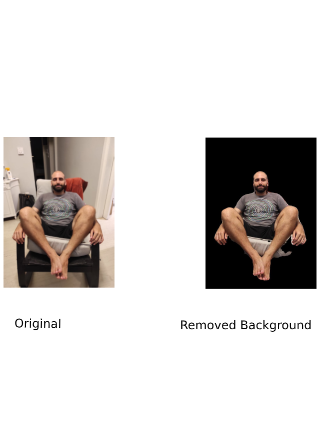

# Segment removal using the FCN-ResNet101

The [remove-bg.py](https://github.com/ChuckTG/Segment_Removal_Pytorch_FCN-ResNet/blob/master/bg_remove.py) file is a python script that removes all the parts of an image except
the regions that represent a class that we want to detect. It then saves the resulting picture with name 'removed_bg.jpg' 

## Packages Required
* numpy
* torch
* torchvision
* PIL
* matplotlib

## Instructions
to run the program:
```bash
git clone https://github.com/ChuckTG/Segment_Removal_Pytorch_FCN-ResNet.git
cd Segment_Removal_Pytorch_FCN-ResNet

python remove_bg.py
```
## Example

This is an output produced by the script:


## References
The FCN-ResNet is loaded from [torchvision.models.segmentation](https://github.com/pytorch/vision/tree/master/torchvision/models/segmentation) and it is a [Fully Convolutional Network](https://arxiv.org/abs/1605.06211) as proposed by Evan Shelhamer et.al and has the ResNet-101 model as backbone.
